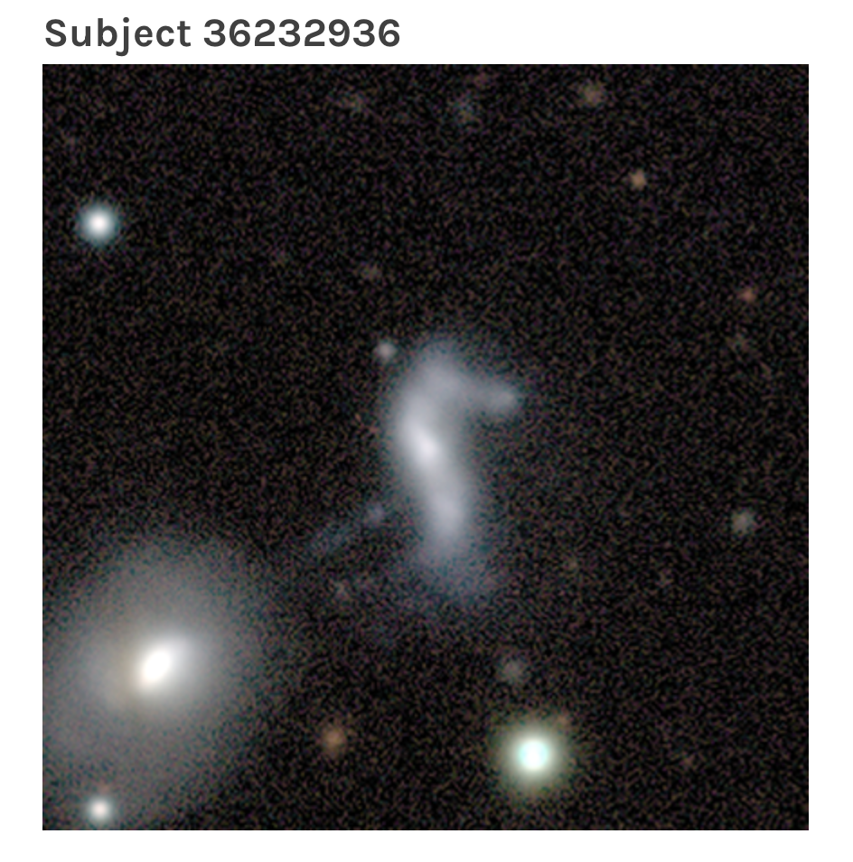
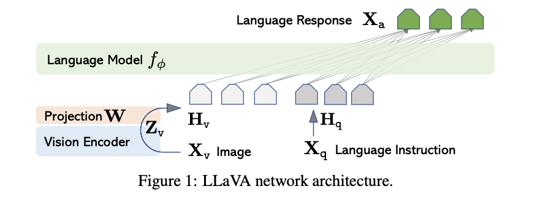

# Multimodal language models for GalaxyZoo image interpretation

## Rationale

The rationale of this project is to leverage existing Multi-Modal Large Models (MLMs) to engage meaningfully with astronomical images. The overarching goal is to build a fine-tuned Language and Vision Model such as LlaVA on a curated dataset from the Galaxy Zoo project. 

The steps of the project are as follows:
1) Explore the Galaxy Zoo Talk dataset
2) Summarise the text using a LLM. For example, we might use LangChain or Llama-index here. 
3) Curate the image - summary pairs for the fine-tuning.
4) Read and understand the high-level details of the LlaVA and Llava-Med papers. 
5) Download the 13B model weights.
6) Fine-tune the model.
7) Evaluate the model.

The architecture of the llava model:

You can watch the [hack presentation][telecon] by Jo during the telecon.

[telecon]: https://u-paris.zoom.us/rec/share/ibQAB_HcRwoRFxrmne3RtWUnGp3xH_bqsS9oOG0vMHZEPJidfSASYsXzR_MzNCM.0GfrQ39bReZsAScg

There is also a good video describing MLMs here: https://www.youtube.com/watch?v=mkI7EPD1vp8

## Dataset

## References

Here is a list of references to get started on the subject
- [LLaVA paper](https://arxiv.org/abs/2304.08485)
- [LLaVA demo](https://llava-vl.github.io/)

LLM-specific resources:
- HuggingFace NLP course: https://huggingface.co/learn/nlp-course/chapter0/1?fw=pt (good for references; understanding the main parts of an NLP pipeline, tokenizer, embeddingings, downstream tasks)
- HuggingFace Transformers (https://huggingface.co/docs/transformers/index) 
- Langchain tutorials, e.g. how to summarise https://python.langchain.com/docs/modules/chains/popular/summarize.html
- OpenAI cookbook: https://github.com/openai/openai-cookbook. This example shows you can you can summarise a paper, for example: https://github.com/openai/openai-cookbook/blob/main/examples/How_to_call_functions_for_knowledge_retrieval.ipynb